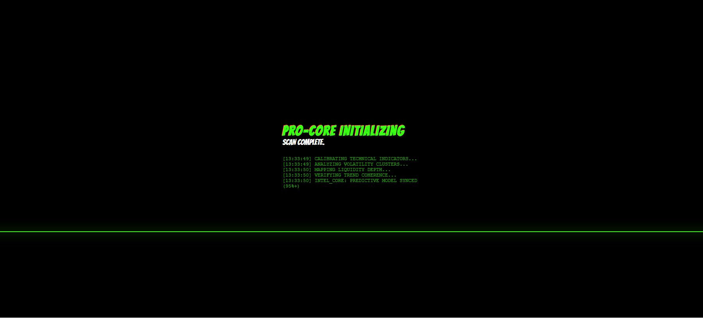
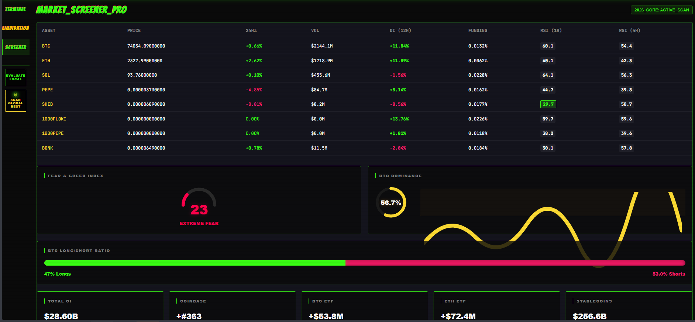
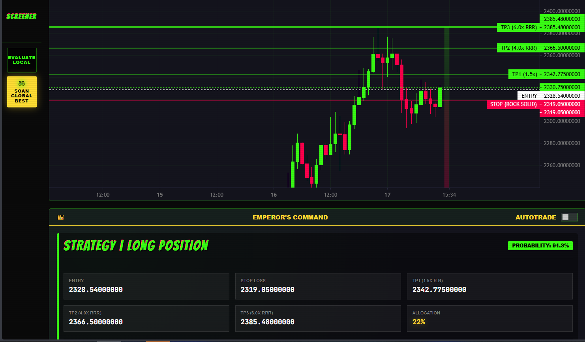

# 👑 DEGEN EMPEROR TERMINAL

> AI-powered execution terminal for crypto traders  
> that not only finds trades — but executes them.
> 
## What is DEGEN EMPEROR TERMINAL?

DEGEN EMPEROR TERMINAL is a closed-core crypto trading platform designed for fast market analysis, structured trade execution, and multi-asset monitoring.

It combines:

- Smart Money Concepts (SMC)
- Real-time market data
- Market screener logic
- Auto-execution workflows
- CEX and DEX connectivity

This repository is the public product documentation layer.  
The core engine is private.

---

## Core capabilities

### 1. Emperor's Command
A deterministic signal system that generates structured LONG and SHORT trade plans.

Each signal can include:

- Entry
- Stop loss
- TP1 / TP2 / TP3
- Probability score
- Allocation guidance

### 2. Market Screener
A multi-asset screener designed to surface high-probability setups without manual chart switching.

Key data layers:

- 24h volume
- Open Interest (12H)
- Funding rates
- Dual RSI (1H / 4H)

## 🤖 Auto-Execution

This is not just signals.

The terminal can execute trades automatically.

- Detects setup
- Generates trade plan
- Executes order

You don’t click.  
You don’t hesitate.  
You execute.

---

## ❌ Why most traders lose

- They hesitate  
- They enter too late  
- They don’t know where to exit  
- They overtrade  

## ✅ What this terminal does

- Gives exact entries  
- Defines risk (SL)  
- Plans exits (TPs)  
- Executes trades  

No guessing. No emotions.

---

## Why this project exists

Most traders do not fail only because of strategy.

They fail because of:

- poor execution
- hesitation
- missing context
- weak trade structure

This terminal was built to reduce decision friction and improve execution consistency.

---

## Public repository model

This repository does **not** contain the private trading core.

It exists to document the system, publish architecture notes, explain the product, and provide a discoverable public surface for the project.

Public:
- product overview
- docs
- screenshots
- guides
- FAQ
- roadmap

Private:
- signal engine
- execution logic
- exchange integration internals
- private strategy implementation

---

## Documentation

- [Architecture](docs/architecture.md)
- [Market Screener Guide](docs/screener-guide.md)
- [Auto-Execution Overview](docs/auto-execution.md)
- [Security Model](docs/security-model.md)
- [FAQ](FAQ.md)
- [Access](ACCESS.md)
- [Disclaimer](DISCLAIMER.md)

---

## Screenshots

---

## Roadmap

- Public landing page
- Access request flow
- More exchange adapters
- Advanced whale-flow layer
- Enhanced reporting and analytics
- Expanded risk-control module

---

## Access

The full terminal is closed-core.

See [ACCESS.md](ACCESS.md) for access model details.

---

## Disclaimer

This repository is for product documentation and educational presentation only.  
It is not financial advice.
